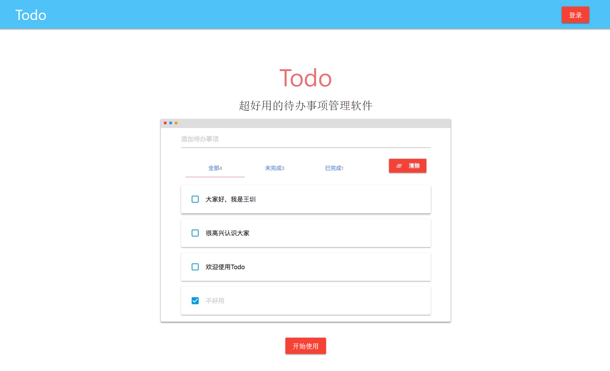
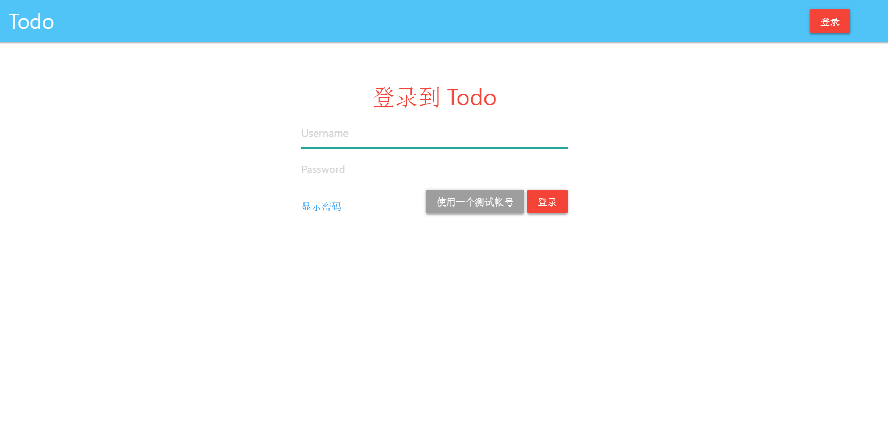
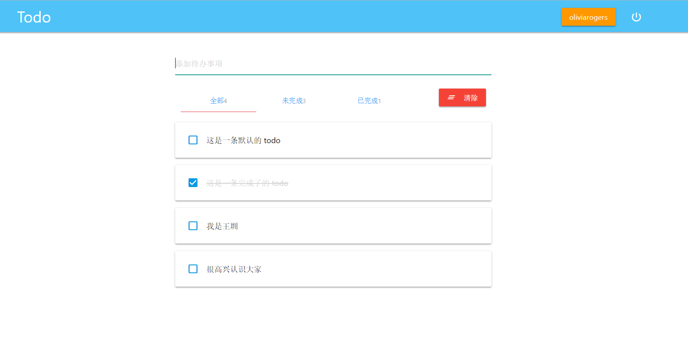

# 待办事项

Demo：http://todo.wangzhen.live/

## 项目介绍

使用 Flask 框架，基于 jQuery 制作的一个简单单页程序，实现了用户的登录注册，显示、添加、修改、删除等功能，单页程序使用 AJAX 技术来实现网页与服务器间的数据交互，也即是整个程序不再通过重新渲染模板来更新程序状态。

## 项目结构

```
| -Todo
  | -app/  # 程序包，用于存储所有代码、模板和静态文件
    | -templates/  # 模板文件
    | -blueprints/  # 博客的主要逻辑
      | -__init__.py 
      | -auth.py  # 认证函数
      | -home.py  # 主页函数
      | -todo.py  # todo 的逻辑函数
    | -static/  # 静态文件
      | -css/
      | -js/  # ajax 函数
    | -__init__.py  # 工厂函数及注册蓝本
    | -models.py  # 数据模型
    | -config.py  # 配置文件
  | -wsgi.py  # 启动程序
  | -.env  # 私有的环境变量
  | -.flaskenv  # 可公开的环境变量
```

## 项目截图




